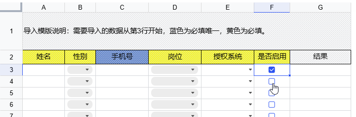
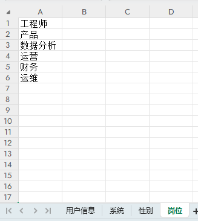
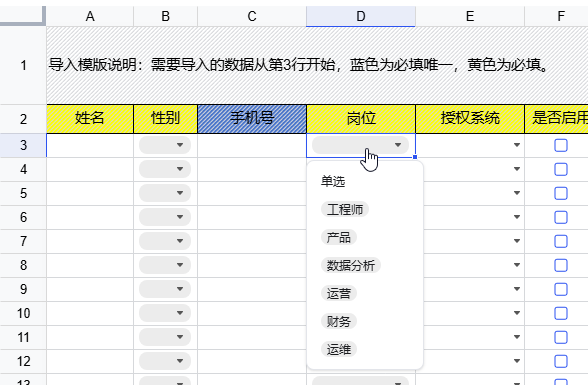
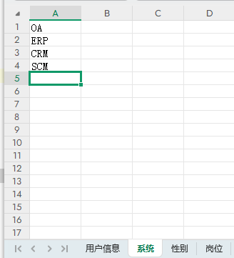
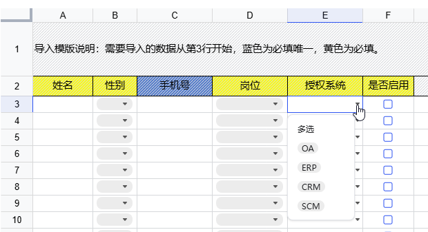

# 复选框 | checkbox

设置F列复选框

```java
UniverWorkbook univerWorkbook = new JsExcel(workbook).render();
univerWorkbook.addComponent("用户信息", ComponentEnum.checkbox, "F3:F65535");
```



# 下拉单选 | list

设置D列下拉单选

```java
UniverWorkbook univerWorkbook = new JsExcel(workbook).render();
//岗位sheet表A列是数据源
univerWorkbook.addComponent("用户信息", ComponentEnum.list, "D3:D65535", "=岗位!$A:$A");
```

### 配置数据源

新建岗位sheet表保存岗位数据。岗位sheet可以配置[隐藏](hidden.md)不让在web上编辑





# 下拉多选 | listMultiple

设置E列下拉单选

```java
UniverWorkbook univerWorkbook = new JsExcel(workbook).render();
univerWorkbook.addComponent("用户信息", ComponentEnum.listMultiple, "E3:E65535", "=系统!$A:$A");
```

### 配置数据源

新建授权系统sheet表保存授权系统数据。授权系统sheet可以配置[隐藏](hidden.md)不让在web上编辑



