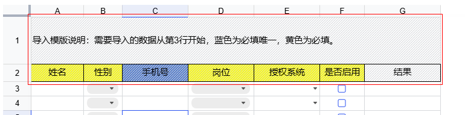

设置第1、2行不可编辑

```java
UniverWorkbook univerWorkbook = new JsExcel(workbook).render();
//第一行
univerWorkbook.addProtectionRange("用户信息", "1:1");
//第二行
univerWorkbook.addProtectionRange("用户信息", "2:2");
```

